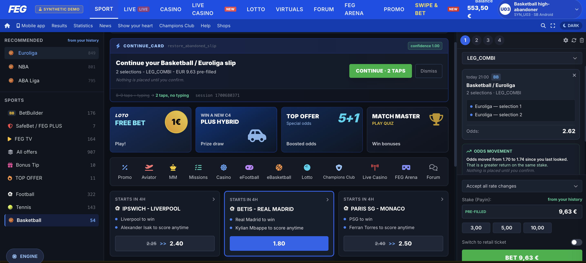
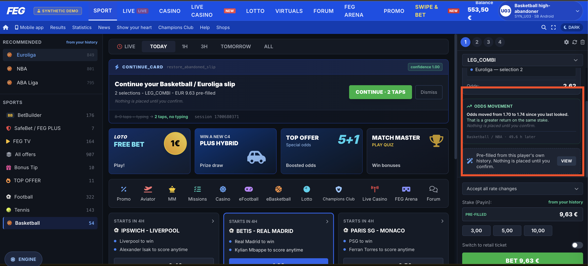
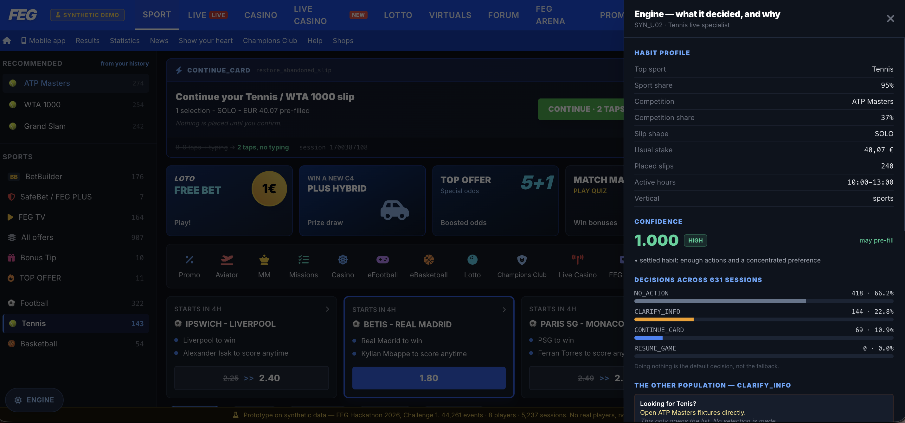
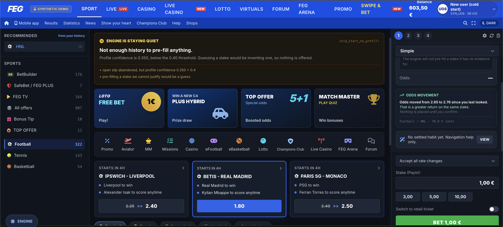
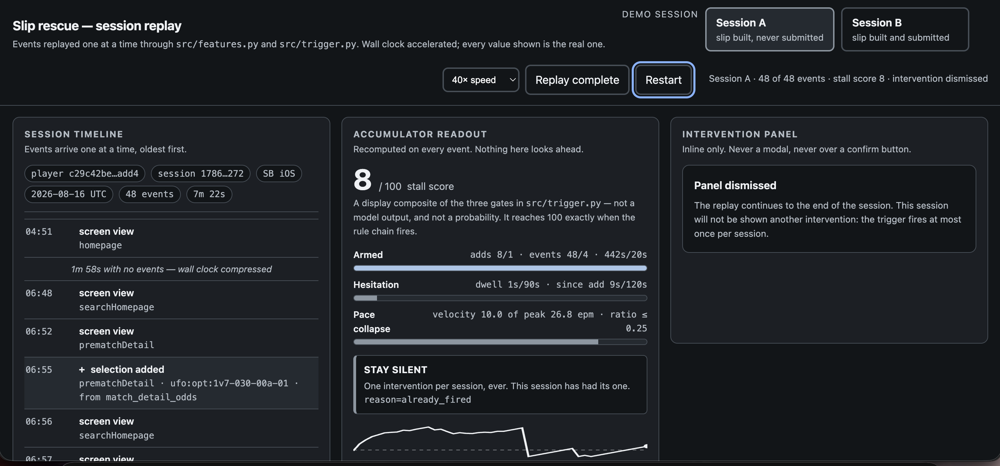
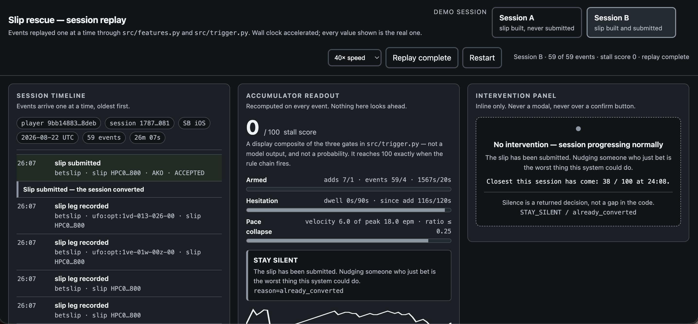

# SessionSense

**Team:** Team Nova
**Challenge:** FEG Innovation Hackathon 2026 — Challenge 1: Session Quality & Session-to-Action Conversion
**Solution:** SessionSense — detect a stalling session with no look-ahead, and offer the minimum useful help, or nothing at all

---

SessionSense is **one system with two halves that necessarily run on two
different datasets**, not two separate projects bundled together:

- **`detection/`** decides, live and with zero look-ahead, whether a session
  is stalling and worth an inline nudge. It runs on **FEG's real, provided
  event log** (332,119 events, 89 players, brand `hr`, Aug 2026) and is
  **validated end to end against it** — including a player-level, out-of-
  sample holdout evaluation.
- **`response/`** decides what the minimum useful help would be — hand back
  an abandoned slip, point someone to what they're looking for, disclose an
  odds move honestly, or say nothing. It runs on an **8-persona synthetic
  dataset** (44,261 events, `is_synthetic=True` on every row) built
  specifically for this, because **FEG's real event log has no stake,
  balance, or monetary field of any kind** — the response half cannot be
  built or tested for honest disclosure against data that cannot express a
  price or a stake.

The two halves are not wired together at runtime (see
`docs/architecture.md` §4 for why, and the exact integration point for
production). Read them as one argument: *detection proves the trigger works
on real behaviour; response proves what a responsible reply looks like once
you have the data to build one.*

Four supporting documents cover the rest in depth:

- [`docs/architecture.md`](docs/architecture.md) — both halves' modules, data flow, the no-look-ahead proofs, the leakage guard, deployment mapping to Kafka/Redis/PostgreSQL/Vue.
- [`docs/compliance-note.md`](docs/compliance-note.md) — data provenance, GDPR, EU AI Act, responsible gambling, symmetric odds disclosure, WCAG 2.1 AA, and the design decisions rejected on purpose.
- [`docs/impact-case.md`](docs/impact-case.md) — the measured 25.29% real-data abandonment finding, out-of-sample lift, and why the 8–9→2 taps figure is a design claim, not a measurement.
- [`docs/dependencies.md`](docs/dependencies.md) — every library and its licence, datasets (FEG-provided vs. synthetic, stated separately), the Font Awesome subset, and an AI-assistance disclosure.
- [`docs/odds-model.md`](docs/odds-model.md) — the honest-disclosure rule for odds movement, in detail.

---

## Problem statement

Challenge 1 asks for better session quality and more session-to-action
conversion. On FEG's own real data, **25.29% of sessions that build a
betslip never submit it** (417 of 1,649 sessions, measured, not estimated —
`docs/impact-case.md` §1). That is one well-defined moment: a player has
already made selections and stops one step short, inside a short window
(median 51s to first action, 7.2 minutes to a submitted bet). The problem is
not "make people bet more" — it is "notice a session about to be lost, and
either help without pressure or leave it alone," in a way that is
defensible line-by-line on a gambling product.

## Solution overview and key innovation

**The key innovation is refusing to guess, structurally, in both halves —
and proving it rather than asserting it.**

- `detection/`'s trigger returns `STAY_SILENT` on 99.73% of all decisions
  (194,178 of 194,711), across six named reasons, every one an explicit
  branch — never a fallthrough, never `None`.
- `response/`'s help engine returns `NO_ACTION` on 74.4% of all synthetic
  sessions (ranging 49–92% per player), and refuses to pre-fill a stake at
  all when a player's habit confidence is below 0.40 (`cold_start_no_
  prefill`) — it will not guess a number it cannot justify from that
  player's own history.
- Both engines are **rule-based, not learned** — every tuning constant lives
  in one readable block per file, and every decision carries a named rule
  plus its evidence, which is what makes an EU-AI-Act-style "why did the
  system treat this user this way" question answerable by reading a file,
  not by inspecting weights.
- **No-look-ahead is proved, not assumed**, in both halves:
  `detection/src/features.py`'s `_test_monotonic_prefix()` and
  `response/src/intent.py`'s `_test_prefix_stability()` both replay
  truncated sessions and assert the state at event N never changes once
  later events exist. See `docs/architecture.md` §1–2.

## Key features / user journey

**Detection.** A stalled slip-building session (pace collapsed against its
own peak, silence past a threshold, at least one selection already added)
fires exactly one inline, dismissible panel per session — never a modal,
never over a confirm button, both exit actions equally weighted (`Review
slip` / `Clear slip`).

**Response.** Four routes, one decision per session, in priority order the
engine actually walks:

1. **`CONTINUE_CARD`** — an abandoned, open slip is handed back with
   sport/competition/slip-type/stake pre-filled from the player's *own*
   history, cutting the flow from ~8–9 taps to 2 (a design claim from
   counting the flow's own steps — `docs/impact-case.md` §5, not a
   measurement).
2. **`CLARIFY_INFO`** — a session circling with nothing selected yet gets
   navigation help only, never a bet prompt — it hasn't shown intent to bet,
   so offering one would answer a question nobody asked.
3. **`RESUME_GAME`** — the casino equivalent of (1): a lobby browsed too
   long with nothing launched gets a one-tap resume to the player's usual
   game.
4. **`NO_ACTION`** — the default, returned far more than any of the above,
   with a named reason every time.

Odds-movement disclosure (when a player returns to a selection they slipped
before) states the price move in one sentence, worse or better, with
identical structure and weight in both directions — `docs/compliance-note.md`
§6.

## Tech stack

- **Python 3** (standard library + a small, permissively-licensed set:
  `duckdb`, `pandas`, `pyarrow`, `numpy`, `openpyxl`) for both engines.
  Full list with licences: `docs/dependencies.md`.
- **DuckDB** for reading/aggregating the real event data (`detection/` only).
- **Playwright + real Chrome**, for `detection/`'s 91-assertion browser test
  suite (build/test tooling only, not a runtime dependency).
- **Plain HTML/CSS/JS, no framework** for both demo surfaces — the detection
  session-replay viewer (`detection/src/ui/index.html`) and the FEG-branded
  mock site (`response/feg-session-engine.html`). Both open on `file://`
  with no server and no build step. The mock site uses the Tailwind CSS
  play-CDN script for utility classes and inlines a Font Awesome subset —
  no other external calls.

## System requirements

- Python 3.10+ (developed and verified against 3.13).
- ~2GB free disk if you place FEG's real dataset under `detection/data set /`
  (see "How to run" — it is not distributed with this repository).
- A modern browser (Chrome/Edge/Firefox/Safari) to view either demo HTML
  file. Real Google Chrome specifically if you want to run
  `detection/scripts/check_ui.py`'s browser-driven test suite.

## Installation

```bash
git clone <this-repo-url> feg-hackathon-2026-team-nova
cd feg-hackathon-2026-team-nova
python3 -m venv .venv
source .venv/bin/activate         # Windows: .venv\Scripts\activate
pip install -r requirements.txt
```

`response/` needs nothing further — its data is already in the repo.
`detection/`'s Python pipeline needs FEG's real dataset placed locally (next
section); its pre-built demo UI does not.

## Environment variables

**None are required.** This is a local, file-based prototype with no
external API calls, no database connection, and no secret of any kind — see
`.env.example`, which is an empty template kept only to satisfy the standard
submission checklist. If this were wired into FEG's live stack (Kafka /
Redis / PostgreSQL — `docs/architecture.md` §5), connection details would go
in `.env`; nothing currently reads them.

## How to run

### `response/` — runs immediately, no data setup

```bash
cd response
python3 src/intent.py             # worked examples + no-look-ahead proof
python3 src/friction.py           # friction-signal census
python3 src/profiler.py           # habit profiles vs. ground truth
python3 src/next_best_help.py     # full routing census + constraint suite
python3 src/odds_movement.py      # odds-disclosure corpus check + worked example
```

Open the mock site directly — it already has engine output embedded:

```bash
open feg-session-engine.html      # macOS; use your OS's file-open equivalent elsewhere
```

To regenerate `site_data.json` from the engine after changing any `src/`
module (then hand-embed it into the page's `<script id="feg-data">` block,
per the header comment in `export_site_data.py`):

```bash
python3 tools/export_site_data.py
```

### `detection/` — demo UI runs immediately; the Python pipeline needs FEG's real dataset

**`detection/src/ui/index.html` is a pre-built, self-contained artifact** —
open it directly, no setup required:

```bash
open detection/src/ui/index.html
```

**To re-run the actual pipeline against FEG's real data**, place the
dataset FEG provided at `detection/data set /` (note the trailing space —
see `detection/docs/DATA_MAP.md`), matching the file names in that doc, then:

```bash
cd detection
python3 scripts/sanitize.py       # strips credentials found in the raw export, writes data/clean/events.parquet
python3 src/replay.py             # consumer-seam self-check
python3 src/features.py           # no-look-ahead proof + bounded-state check
python3 src/trigger.py            # trigger over all 1,649 slip-building sessions
python3 scripts/holdout_eval.py   # out-of-sample, player-level evaluation
python3 scripts/pick_demo_sessions.py   # (re)selects the two demo sessions
python3 scripts/build_ui.py       # regenerates src/ui/index.html from real pipeline output
```

FEG's real dataset is **not included in this repository** (see
`.gitignore` and `docs/compliance-note.md` §1) — it is FEG's data, provided
directly to hackathon participants, not something this submission
redistributes.

## How to test

```bash
# response/ — every module doubles as its own test suite (no test runner needed)
cd response && python3 src/intent.py && python3 src/friction.py && \
  python3 src/profiler.py && python3 src/next_best_help.py && python3 src/odds_movement.py

# detection/ — same pattern, requires the real dataset (see above)
cd detection && python3 src/replay.py && python3 src/features.py && python3 src/trigger.py

# detection/ — browser-driven accessibility/contract suite (91 assertions, needs real Chrome)
cd detection && .venv-ui/bin/python scripts/check_ui.py
```

Every script above prints `PASS`/`FAIL` per check and exits non-zero on any
failure — there is no separate assertion framework to install.

## Demo flow

1. Open `detection/src/ui/index.html`. Replay the two selected real sessions
   (`detection/config/demo_sessions.json`) side by side — one ends in a
   `FIRE` panel, one in `STAY_SILENT` — to show the trigger is not "always
   on."
2. Point at the panel contract: identical Review/Clear buttons, inline,
   never a modal, dismissible by `Esc`.
3. Switch to `response/feg-session-engine.html`. Cycle through at least
   SYN_U03 (the high-abandonment demo user, `CONTINUE_CARD`), SYN_U04 or
   SYN_U06 (casino, `RESUME_GAME`), and SYN_U08 (cold start — refuses to
   pre-fill, `NO_ACTION`/`CLARIFY_INFO` only).
4. Show one odds-movement card where the price got worse and one where it
   got better, side by side, to make the symmetric rendering visible rather
   than asserted.
5. Close on `docs/impact-case.md`: the measured 25.29% real-data
   abandonment finding, the honestly-reported out-of-sample lift collapse
   (1.75x → 1.19x), and the 8–9→2 taps figure named explicitly as a design
   claim.

Recording script and shot list: [`demo/demo-video-link.md`](demo/demo-video-link.md).

## Screenshots

### `response/` — the help engine on synthetic data

**The continue card.** SYN_U03's abandoned slip handed back with sport,
competition, slip type and stake pre-filled from that player's own history —
2 taps to confirm instead of ~8–9 plus typing.



**Odds moved against the player, disclosed anyway.** The price got worse
since they last looked and the card says so, in the same sentence structure
and visual weight used when a price improves — no filtering on sign, no
urgency framing (`docs/compliance-note.md` §5).



**Silence, as a returned decision.** `NO_ACTION` with a named reason — the
engine's default at 74.4% of all sessions, not an absence of output.



**The cold-start refusal.** SYN_U08 has 6 weeks of history and confidence
0.350, below the 0.40 pre-fill gate, so the engine declines to pre-fill a
stake: *"pre-filling a stake we cannot justify would be a guess."*



### `detection/` — the trigger on FEG's provided event log

**Session A: stalled, trigger fired.** Slip built, pace collapsed against the
session's own peak, inline panel offered with two equally weighted exits.



**Session B: converted, stayed silent.** `STAY_SILENT` / `already_converted`
— the bet is placed, so nudging is the worst available action. This is the
99.73% case.



## Known limitations and assumptions

- **The two halves are not integrated at runtime.** `detection/`'s `FIRE`
  decision is the intended trigger for `response/`'s help engine in
  production, but this has not been built or tested, because no dataset
  available to us can test it honestly (`docs/architecture.md` §4,
  `docs/impact-case.md` §5).
- **FEG's real dataset is not representative.** 89 hand-picked *top* users,
  one brand, one market, one month. Every real-data rate in
  `docs/impact-case.md` is an upper bound on this sample, not a brand-wide
  estimate.
- **Detection's lift is platform-dependent and the cause is ambiguous.**
  Only SB iOS survives out-of-sample evaluation (1.28x lift); GM and SB
  Android are at or below the base rate, and this may reflect a genuine
  behavioural difference, an Android screen-instrumentation gap, or both —
  the dataset cannot separate them (`docs/impact-case.md` §2,
  `docs/dependencies.md` §6).
- **No euro/revenue figure is measured or published as a headline number.**
  FEG's real data has no session-to-money key at all, so any euro figure is
  explicitly labelled `[MODELLED]`, and the uplift parameter needed to turn
  it into recovered revenue can only come from a live A/B test
  (`docs/impact-case.md` §6).
- **The 8–9→2 taps figure is a design claim from counting flow steps, not a
  measurement.** Neither dataset records taps or session recordings of real
  users; it should be measured in a live test before being cited as a
  result (`docs/impact-case.md` §5).
- **The response engine has never seen a real user.** It is built and
  validated entirely on 8 synthetic personas; its behaviour on FEG's real
  player population, once real stake data is available under NDA, is
  untested.
- **The Croatian self-exclusion register check is acknowledged, not
  implemented.** Neither dataset contains identity or register data to
  build or test it against; the integration point is named in
  `docs/architecture.md` §5.
- **WCAG 2.1 AA is machine-verified for the detection replay UI only.** The
  response mock site's static chrome has not been run through an equivalent
  accessibility audit — stated as a known gap in `docs/compliance-note.md`
  §6, not implied as covered.
- **The response mock site carries static promotional chrome the engine
  never drives** (unrelated fixture tiles, odds tickers) — see
  `docs/compliance-note.md` §7. Two elements that read as pressure mechanics
  (an "ALL IN" stake button, a "🔥 364+ BETS" badge) were removed during
  this submission pass precisely because static chrome sitting next to
  engine-driven, rule-governed content risks implying the whole page
  follows those rules.
